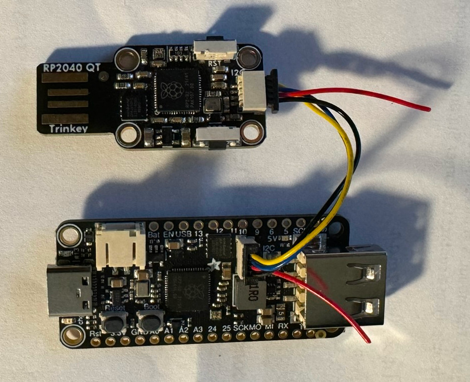
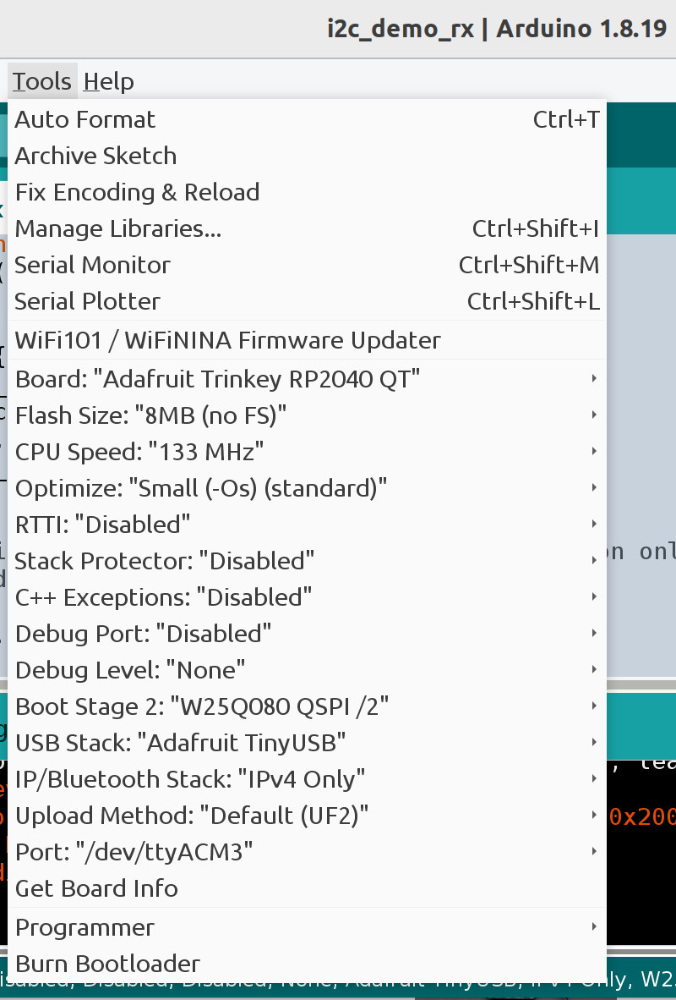

# I2C Joystick Demo

i2c_demo_rx shows how to receive HID joystick parameters from an I2C port then
send the parameters out the USB joystck port. The board running i2c_demo_rx can
be connected to another board as an I2C peripheral. i2c_demo_rx tested on an
Adafruit Trinkey QT2040 board.

The cut red wire is shown with the ends flying but ends will be trimmed to
avoid accidentally shorting 3.3V. More on the red wire below.

## i2c_demo_rx RGB LED

On power up, the LED is red. If the LED stays red, there is no USB connection.
This can happen if something is wrong the USB connector or cable so the board
receives power but is not able to communicate over the USB data wires. If the
board gets a good USB connection, the LED turns green.

## i2c_demo_tx

i2c_demo_tx is a simple test program to verify correct operation of
i2c_demo_rx. i2c_demo_tx tested on an Adafruit Feather RP2040 with USB Type A
Host board.

The boards are connected to each other via QWIIC/Stemma QT ports using a QWIIC
cable with the red wire cut. i2c_demo_tx/Feather RP2040 is configured as the
I2C controller. The Trinkey/i2c_demo_rx is configured as the I2C peripheral.

i2c_demo_tx (running on the Feather RP2040 with USB host) sends HID joystick
information out its QWIIC port to the Trinkey QWIIC port. i2c_demo_rx (running
on Trinkey) receives HID joystick information on it QWIIC port. i2c_demo_rx
sends the HID joystick information out its USB port.

## Warning: Cut the red wire

Cut the red wire on the QWIIC cable to avoid damaging the boards. Both boards
are sourcing power on the QWIIC red wire. Power outputs should never be
connected to each other. Both boards are powered from their USB connectors so
there is no need for power from the QWIIC cable.

## Build Examples

Use Earle Philhower [Arduino board package for
RP2040](https://github.com/earlephilhower/arduino-pico).

Use the IDE Library Manager to install the following libraries.

* "Adafruit TinyUSB Library"
* "Adafruit NeoPixel"

Install this project as a library by download it as a ZIP file from https://github.com/touchgadget/flight_stick_tinyusb.
Then use the Arduino IDE option to install the ZIP as a library.
